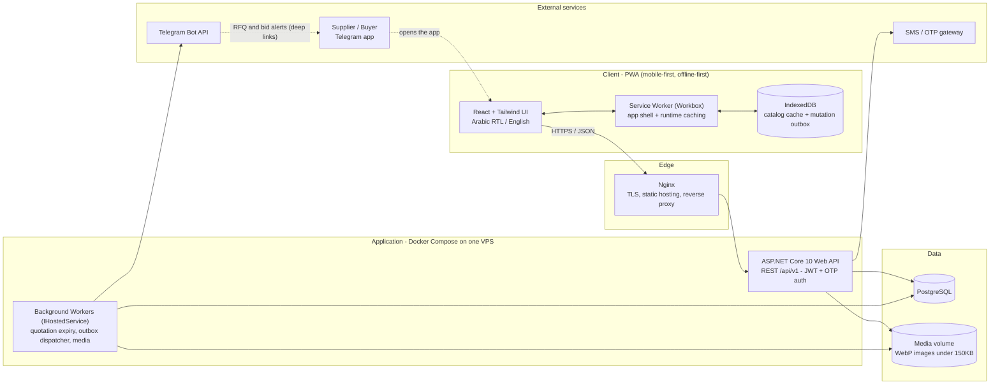
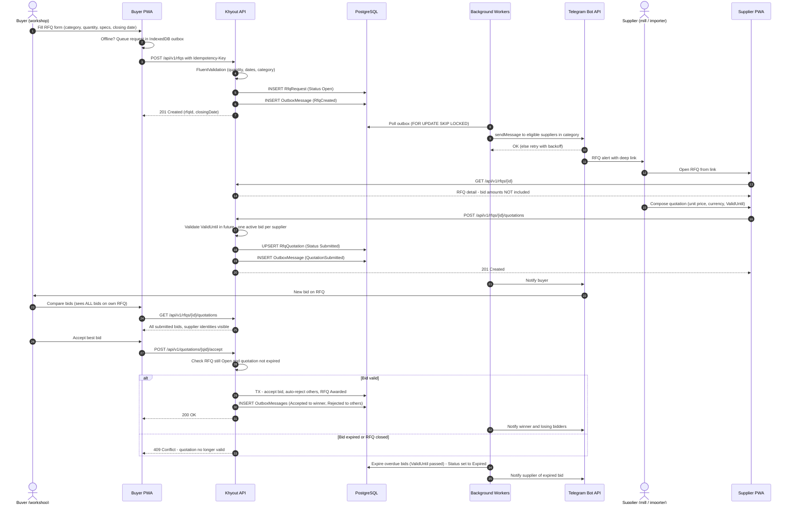

# Khyout Platform — Phase 1: Architecture & Technical Specification

| | |
|---|---|
| **Project** | Khyout — B2B marketplace for the Syrian textile supply chain (garment workshops ↔ fabric/yarn suppliers) |
| **Repository (workspace)** | `D:\ForGitUploads\B2BMarketPlace` |
| **Document** | Phase 1 of 4 deliverable — for review before Phase 2 begins |
| **Date** | 2026-09-29 |
| **Status** | Draft — awaiting user review & approval to proceed to Phase 2 |

**Deliverable set (this phase):**

1. `khyout-phase1-architecture-2026-09-29.html` — review report with rendered diagrams (self-contained).
2. `khyout-phase1-spec-2026-09-29.md` — this document: full technical specification.
3. `khyout-phase1-system-architecture-2026-09-29.mmd` — Mermaid source: high-level system architecture.
4. `khyout-phase1-database-erd-2026-09-29.mmd` — Mermaid source: complete database ERD with keys, relationships, indexes.
5. `khyout-phase1-rfq-lifecycle-2026-09-29.mmd` — Mermaid source: RFQ lifecycle sequence diagram.

All artifacts are staged in the AutoCoder delivery folder (`...\agents\auto-coder\workspace\DELIVERY\`). During Phase 2, the `.mmd` sources and this spec can be copied into the repository under `docs/architecture/`.

---

## 1. Context & Constraints

**Domain.** Khyout connects two sides of the Syrian textile manufacturing chain:

- **Buyers** — garment workshop owners sourcing raw fabrics and yarn.
- **Suppliers** — fabric importers, spinning mills.

**Core modules (MVP scope):**

1. Dynamic product catalog with textile-technical attributes (GSM, composition, weave).
2. RFQ workflow with time-bound quotations.
3. Swatch/sample ordering.
4. Out-of-band notifications via Telegram.

**Hard constraints inherited from the project brief and `agent.md`:**

| # | Constraint | Consequence for design |
|---|---|---|
| C1 | Unstable, slow connectivity (both server-side and client-side) | Offline-first PWA, lean payloads, retry queues, server-side outbox for notifications |
| C2 | Image budget: WebP only, <150 KB per image | Server-side transcode pipeline (ImageSharp) with quality iteration |
| C3 | Fabric entries must carry technical specs: GSM, composition %, weave structure | Structured attribute model, not generic retail products |
| C4 | Quotations MUST have explicit `ValidUntil`; expired bids cannot be accepted | Invariant in domain + background expiry worker + accept-time re-validation |
| C5 | Suppliers must never see each other's bid amounts | Role-aware DTO projection and authorization policies |
| C6 | All list queries paginated; max 50 items per page | `PagedResult<T>` convention, server-enforced cap |
| C7 | Resource-constrained hosting | Single-VPS Docker Compose deployment; SQLite for local dev |

**Non-goals for the MVP** (deliberately out of scope; revisited post-MVP): online payments/escrow, logistics tracking, in-app chat, multi-currency FX snapshotting, supplier-initiated RFQs, mobile native apps, full-text search (planned hook only), real-time push (Telegram covers alerts).

---

## 2. Tech Stack & Architecture Decisions

| Area | Decision | Rationale / notes |
|---|---|---|
| Runtime | **.NET 10 (LTS), ASP.NET Core Web API** | Matches `agent.md` baseline (.NET 9/10). LTS = support window suitable for a long-lived platform; code stays compatible with .NET 9 if hosting constraints demand it. |
| Architecture | **Clean Architecture + Vertical Slices (CQRS-lite)** | Layers: Domain → Application → Infrastructure → API. Each feature is a self-contained slice under `Application/Features`. |
| Dispatch | **Thin in-house dispatcher** (`ICommand`/`IQuery` + pipeline behaviors) | Avoids third-party mediator licensing drift; tiny surface; validation & logging as behaviors. If the team prefers MediatR, the shape is drop-in compatible. |
| Persistence | **EF Core 10**; **PostgreSQL** (production), **SQLite** (local dev) | Fluent API configuration; migrations authored for PostgreSQL. Keep to the portable feature subset so dev on SQLite behaves like prod. |
| Validation | **FluentValidation** | Per `agent.md`; invoked automatically by the dispatcher pipeline. |
| API shape | REST, `/api/v1`, standardized envelope `{ success, data, error, meta }` | Single response wrapper per brief; errors carry stable machine-readable codes. |
| Authentication | **Phone number + OTP**; JWT access token (15 min) + rotating refresh token (30 days, hashed at rest); RBAC: `Buyer`, `Supplier`, `Admin` | OTP is the lowest-friction auth for the target market (no email dependency). |
| OTP delivery | `ISmsSender` abstraction with pluggable providers; optional Telegram fallback channel | SMS aggregator availability/cost in Syria is uncertain — the abstraction keeps this swappable and testable. |
| Background work | `IHostedService` / `BackgroundService` workers hosted in the API process: quotation/RFQ expiry, outbox dispatcher, media cleanup | Lean single-process deployment; `SELECT … FOR UPDATE SKIP LOCKED` used for outbox/polling so workers can scale out later without redesign. |
| Notifications | **Transactional outbox → Telegram Bot API** with retry + exponential backoff; per-event templates | No message loss when Telegram or the network is down; degrades gracefully. |
| Media pipeline | Upload → validation → **ImageSharp** → WebP, longest edge 1600 px, quality iterated to ≤150 KB; content-hash file names; immutable cache headers | Enforces the asset budget (C2) at the only place that can enforce it — the server. |
| Frontend | **Vite + React + TypeScript + Tailwind CSS**, PWA via Workbox; **Dexie (IndexedDB)** for cache + mutation outbox; `react-i18next` | See 2.1 for why Vite/React over Next.js. |
| Localization | **Arabic (RTL, default) + English** | Target market is Arabic-first; UI must be built RTL from the start, not retrofitted. |
| Pagination | `PagedResult<T>` (`items, pageNumber, pageSize, totalCount, totalPages`); default 20, **hard cap 50** | `agent.md` invariant C6. |
| Hosting | **Docker Compose** on one VPS: `nginx` (TLS, static hosting, reverse proxy) + `api` + `postgres` + volumes (pgdata, media); nightly `pg_dump` backups | Fits constrained budgets; scales vertically; can split services later. |
| Observability | Serilog structured logs (console + rolling file); `/health/live` + `/health/ready` endpoints | Minimum viable ops for a small team. |
| Testing | xUnit + FluentAssertions; `WebApplicationFactory` integration tests; domain invariant unit tests (expiry, composition sum, pagination cap, bid privacy) | Invariants C3–C6 are covered by executable tests from Phase 2 onward. |

### 2.1 Why Vite + React (PWA) over Next.js

- The product is an **app-like, authenticated tool**, not a content/SEO site — server-side rendering buys little here.
- **Offline-first** (Workbox service worker + IndexedDB sync queue) is simpler to reason about in a static SPA than in an SSR framework.
- **Leaner infrastructure**: the client is static files served by nginx — no Node.js runtime in production, one less moving part on a constrained VPS.
- Tailwind + React covers the mobile-first UI needs; Vite builds are fast and cache-friendly for the client deliverable.

*Next.js remains a valid alternative if the team later wants SEO landing pages; the API contract is unchanged either way.*

---

## 3. System Architecture (High-Level)



**Reading notes**

- The **client stays useful offline**: catalog pages are served from the Service Worker cache; mutations (RFQ creation, bids, sample requests) are queued in IndexedDB and replayed when connectivity returns, with idempotency keys to prevent duplicates.
- **All external calls go through the server.** The client never talks to Telegram or the SMS gateway directly.
- The **outbox worker** is the only component that talks to Telegram; if Telegram is unreachable, messages stay queued and retried with backoff.
- PostgreSQL is the single system of record — including the notification outbox (no external queue required at this scale).

---

## 4. Cross-Cutting Concerns

### 4.1 Authentication & RBAC

- **Flow:** enter phone → receive 6-digit OTP (TTL 5 min, max 5 attempts, throttled per phone/IP) → verify → JWT pair issued. New users continue into company onboarding.
- **Tokens:** access JWT 15 min; refresh token 30 days, rotated on use, stored hashed (`REFRESH_TOKENS.TokenHash`), revocation on logout.
- **Roles:** `Buyer`, `Supplier`, `Admin`. Company membership: one company per user (MVP).
- **Company verification:** companies start `Pending`; an Admin verifies (`Verified`) — only verified companies can publish products, create RFQs, or bid.

### 4.2 RFQ bid privacy (invariant C5)

- **Buyer (owner of the RFQ):** sees all quotations on their RFQ.
- **Supplier:** sees only their own quotation (amount, validity).
- **Admin:** sees everything (moderation/support).
- Enforcement is **inside the query/DTO projection layer** (role-aware slices), not only in controllers, plus authorization policies per resource owner. Covered by integration tests.

### 4.3 Time-bound quotations (invariant C4)

- `RfqQuotation.ValidUntil` is **required and must be in the future** at submission (FluentValidation + domain rule).
- An expiry worker marks overdue quotations `Expired` (checked every minute; index `(valid_until, status)`).
- **Accept-time re-validation:** accepting an expired quotation or a closed RFQ returns `409 Conflict` — expiry is enforced twice (worker + write path), so a stale worker can never allow a bad acceptance.
- RFQ `ClosingDate` blocks new bids; the buyer may extend it while the RFQ is `Open`.

### 4.4 Pagination & filtering conventions

- Every list endpoint returns `PagedResult<T>`; `pageSize` clamp [1..50] server-side.
- Catalog filters: `categoryId`, `gsmMin`/`gsmMax`, `fibers` (e.g. contain Cotton ≥ 90 %), `moqMax`, `city`, `status`; deterministic sort whitelist (newest, MOQ, GSM).

### 4.5 Offline-first client strategy

- App shell precached; catalog responses cached **stale-while-revalidate**; RFQ detail **network-first** with cache fallback.
- Mutation outbox (Dexie): each queued request gets a client-generated `Idempotency-Key`; replay on `online` event + periodic retry.
- Optimistic UI for bid submission and RFQ creation; server remains authoritative (reconciliation on replay response).
- v1 scope: offline covers browsing + submitting; bid comparison requires a sync (documented for users).

### 4.6 Media pipeline (invariant C2)

- Accept JPEG/PNG/WebP uploads up to 5 MB → decode → resize (longest edge 1600 px) → encode WebP, iterate quality (start 82) until ≤150 KB → store by content hash → serve with `Cache-Control: public, immutable`.
- Rejected/oversized source files never enter storage.

### 4.7 Notifications (outbox → Telegram)

- Every domain event that must notify someone writes an `OUTBOX_MESSAGES` row **in the same transaction** as the state change.
- Dispatcher polls (`SKIP LOCKED`), sends via Telegram Bot API, marks `Sent`; failures increment `Attempts` with exponential backoff → `Failed` after max attempts (visible to admins).
- Event templates: `RfqCreated` (suppliers in category), `QuotationSubmitted` (buyer), `QuotationAccepted`/`QuotationRejected` (suppliers), `QuotationExpired`, `SampleRequested`, `SampleStatusChanged`.

### 4.8 Resilience

- Client: retry queue with backoff + idempotency keys; no user-visible data loss on flaky networks.
- Server: outbox for all external sends; Polly-style retry/backoff for Telegram/SMS calls (implemented as a small typed policy, no heavy dependencies).
- DB: nightly `pg_dump`; restore script in `deploy/scripts/`.

### 4.9 Security hardening

- HTTPS only (nginx TLS), HSTS; rate limiting on OTP endpoints (built-in `RateLimiter`), login throttling.
- Secrets via environment variables (`.env` outside VCS), never checked in.
- EF parameterized queries only; no string-concatenated SQL.
- Input validation at boundary (FluentValidation) + domain guards; output projection strips private fields (4.2).
- OTP codes and refresh tokens stored only as hashes.

### 4.10 Testing strategy

- **Domain unit tests:** invariants — composition sums to 100 (±0.5), ValidUntil future-only, pagination cap, state transitions.
- **Integration tests:** auth flow; RFQ create → bid → accept → expire; privacy matrix (supplier cannot read others' bids); outbox dispatch (fake Telegram transport).
- Test DB: SQLite in-memory for speed; PostgreSQL via Testcontainers for migration/behavior parity when CI allows.

## 5. Data Model

### 5.1 Entity catalog (13 tables)

| Entity | Purpose | Notable fields | Invariants |
|---|---|---|---|
| `USERS` | Accounts; phone = identity | `PhoneNumber` (unique), `Role`, `CompanyId` (nullable for Admin) | One user belongs to one company (or none for Admin) |
| `OTP_CODES` | Login / onboarding codes | `CodeHash`, `ExpiresAt`, `AttemptsMade` | Never stores plaintext; TTL 5 min |
| `REFRESH_TOKENS` | JWT refresh rotation chain | `TokenHash` (unique), `ExpiresAt`, `RevokedAt`, `ReplacedByTokenId` | Hashed at rest; rotated on use; revocable |
| `COMPANIES` | Buyer workshops and supplier mills/importers | `Type`, `City`, `VerificationStatus` | Must be `Verified` to publish, create RFQs, or bid |
| `CATEGORIES` | Fabric/yarn taxonomy (self-referencing tree) | `Slug` (unique), `ParentId`, `NameAr`/`NameEn` | Two levels in MVP |
| `PRODUCTS` | Supplier listings | `MOQ`, `UnitOfMeasure`, `Status`, `IndicativePrice` | Indicative price is informational — quotations bind |
| `FABRIC_ATTRIBUTES` | Technical specs, 1:1 with product | `Gsm`, `GsmTolerancePct`, `WeaveStructure`, `WidthCm` | Mandatory for every active product (invariant C3) |
| `FABRIC_COMPOSITION` | Fiber percentages, 1:N per product | `FiberType`, `Percentage` | Rows sum to 100 (±0.5); unique per (product, fiber) |
| `PRODUCT_IMAGES` | WebP media records | `StoragePath`, `ContentHash`, `SizeBytes` | Target ≤150 KB (invariant C2); hash-deduped |
| `RFQ_REQUESTS` | Buyer request for quotation | `QuantityNeeded`, `ClosingDate`, `Status`, `AcceptedQuotationId` | `ClosingDate` blocks new bids |
| `RFQ_QUOTATIONS` | Supplier bids | `UnitPrice`, `Currency`, `ValidUntil`, `Status` | `ValidUntil` required & future (C4); one active bid per supplier per RFQ |
| `SAMPLE_REQUESTS` | Swatch / sample ordering | `Status` flow, optional quotation link | `Requested → Approved → Shipped → Received` (or `Rejected`) |
| `OUTBOX_MESSAGES` | Durable notification queue (Telegram) | `Type`, `Payload`, `Status`, `NextAttemptAt` | Written in the same transaction as the state change |

### 5.2 Keys & indexes

All IDs are client-side-generated UUID v4 (portable across PostgreSQL/SQLite). All timestamps are UTC (`timestamptz` in PostgreSQL). Enums are stored as `varchar` with `CHECK` constraints for readability and smooth migrations.

| Table | Unique | Secondary indexes | Serves |
|---|---|---|---|
| `users` | `phone_number` | `company_id`; `role` | login, company listing |
| `refresh_tokens` | `token_hash` | `user_id`; `expires_at` | rotation, revocation sweeps |
| `otp_codes` | — | `(phone_number, purpose, expires_at)`; `expires_at` | verify lookup; TTL cleanup |
| `companies` | — | `city`; `verification_status`; `name` | city filter; admin moderation |
| `categories` | `slug` | `(parent_id, sort_order)` | tree rendering |
| `products` | — | `supplier_company_id`; `(category_id, status, created_at DESC)`; `moq` | catalog browsing & filters |
| `fabric_attributes` | `product_id` | `gsm`; `weave_structure` | GSM/weave filters |
| `fabric_composition` | `(product_id, fiber_type)` | `(fiber_type, percentage)` | “contains fiber ≥ X %” filter |
| `product_images` | — | `(product_id, sort_order)` | gallery ordering |
| `rfq_requests` | — | `(buyer_company_id, created_at DESC)`; `(category_id, status)`; `(status, closing_date)` | buyer lists; supplier feed; closing worker |
| `rfq_quotations` | `(rfq_request_id, supplier_company_id)` | `(rfq_request_id, status)`; `(supplier_company_id, created_at DESC)`; `(valid_until, status)` | bid lists; expiry worker |
| `sample_requests` | — | `(buyer_company_id, created_at DESC)`; `(supplier_company_id, status)` | both inboxes |
| `outbox_messages` | — | `(status, next_attempt_at)`; `created_at` | dispatcher polling |

### 5.3 Integrity & concurrency rules

- **FK behavior:** `RESTRICT` by default (history is protected); `CASCADE` only for owned children (`fabric_composition`, `fabric_attributes`, `product_images` under a product; `refresh_tokens` under a user).
- **Check constraints:** `percentage BETWEEN 0 AND 100`; `quantity > 0`; `gsm > 0`; `size_bytes > 0`; enum columns constrained to their value sets.
- **Concurrency:** optimistic concurrency token on `rfq_quotations` and `rfq_requests` (EF concurrency token) so two simultaneous “accepts” can never both win; the accept operation runs in a single transaction (accept one bid, auto-reject the others, mark the RFQ `Awarded`).
- **Composition rule:** each product’s fiber percentages sum to 100 with ±0.5 tolerance, enforced in the domain before save.

### 5.4 Complete ERD

```mermaid
%% Khyout B2B Marketplace - Phase 1 deliverable
%% Complete Database ERD (keys, relationships, indexes)
%% Index details are listed as comments below the entity definitions.
erDiagram
  COMPANIES |o--o{ USERS : "employs"
  USERS ||--o{ REFRESH_TOKENS : "owns"
  USERS |o--o{ COMPANIES : "verifies (admin)"
  COMPANIES ||--o{ PRODUCTS : "supplies (seller)"
  CATEGORIES ||--o{ CATEGORIES : "parent of"
  CATEGORIES ||--o{ PRODUCTS : "classifies"
  PRODUCTS ||--|| FABRIC_ATTRIBUTES : "has tech specs"
  PRODUCTS ||--|{ FABRIC_COMPOSITION : "composed of"
  PRODUCTS ||--o{ PRODUCT_IMAGES : "pictured by"
  COMPANIES ||--o{ RFQ_REQUESTS : "issues (buyer)"
  CATEGORIES ||--o{ RFQ_REQUESTS : "scopes"
  RFQ_REQUESTS ||--o{ RFQ_QUOTATIONS : "receives bids"
  COMPANIES ||--o{ RFQ_QUOTATIONS : "bids (supplier)"
  RFQ_REQUESTS |o--o| RFQ_QUOTATIONS : "awards"
  COMPANIES ||--o{ SAMPLE_REQUESTS : "requests (buyer)"
  COMPANIES ||--o{ SAMPLE_REQUESTS : "fulfills (supplier)"
  PRODUCTS ||--o{ SAMPLE_REQUESTS : "sampled via"
  RFQ_QUOTATIONS |o--o{ SAMPLE_REQUESTS : "referenced by"

  USERS {
    uuid Id PK
    varchar PhoneNumber UK "E.164 normalized - unique login"
    varchar FullName
    varchar Role "Buyer / Supplier / Admin"
    uuid CompanyId FK "nullable for platform Admin"
    bool IsActive
    timestamptz CreatedAt
    timestamptz UpdatedAt
  }
  REFRESH_TOKENS {
    uuid Id PK
    uuid UserId FK
    varchar TokenHash UK "SHA-256, rotated on refresh"
    timestamptz ExpiresAt
    timestamptz RevokedAt
    uuid ReplacedByTokenId FK "rotation chain"
    timestamptz CreatedAt
  }
  OTP_CODES {
    uuid Id PK
    varchar PhoneNumber "pre-registration, no FK"
    varchar Purpose "Login / Onboarding"
    varchar CodeHash "never store plaintext"
    smallint AttemptsMade
    timestamptz ExpiresAt
    timestamptz ConsumedAt
    timestamptz CreatedAt
  }
  COMPANIES {
    uuid Id PK
    varchar Name
    varchar Type "Buyer / Supplier"
    varchar City "filter dimension"
    text Address
    text Bio
    varchar VerificationStatus "Pending / Verified / Rejected"
    timestamptz VerifiedAt
    uuid VerifiedByUserId FK "nullable"
    varchar LogoPath "nullable"
    timestamptz CreatedAt
    timestamptz UpdatedAt
  }
  CATEGORIES {
    uuid Id PK
    varchar Slug UK
    varchar NameAr
    varchar NameEn
    uuid ParentId FK "nullable - tree"
    int SortOrder
    bool IsActive
  }
  PRODUCTS {
    uuid Id PK
    uuid SupplierCompanyId FK
    uuid CategoryId FK
    varchar Title
    text Description
    numeric MOQ "minimum order quantity"
    varchar UnitOfMeasure "Meter / Kg / Roll / Yard"
    numeric IndicativePrice "nullable - quotes bind"
    varchar Currency "nullable - USD default"
    varchar Status "Draft / Active / Archived"
    timestamptz CreatedAt
    timestamptz UpdatedAt
  }
  FABRIC_ATTRIBUTES {
    uuid Id PK
    uuid ProductId FK "unique - 1:1 with product"
    int Gsm "grams per square meter"
    int GsmTolerancePct "e.g. 5 means +/-5 percent"
    varchar WeaveStructure "Plain / Twill / Satin / Knit / Denim"
    int WidthCm
    varchar ColorFamily "optional"
    int WeightPerMeterG "optional"
    text CareNotes "optional"
  }
  FABRIC_COMPOSITION {
    uuid Id PK
    uuid ProductId FK
    varchar FiberType "Cotton / Lycra / Viscose / Polyester"
    numeric Percentage "0-100, per product sums to 100"
  }
  PRODUCT_IMAGES {
    uuid Id PK
    uuid ProductId FK
    varchar StoragePath
    varchar ContentHash UK "dedupe"
    int WidthPx
    int HeightPx
    int SizeBytes "target 150KB max"
    smallint SortOrder
  }
  RFQ_REQUESTS {
    uuid Id PK
    uuid BuyerCompanyId FK
    uuid CategoryId FK
    varchar Title
    text Description
    numeric QuantityNeeded
    varchar UnitOfMeasure "Meter / Kg / Roll / Yard"
    date TargetDeliveryDate
    timestamptz ClosingDate "no new bids after"
    varchar Status "Open / Awarded / Cancelled / Expired"
    uuid AcceptedQuotationId FK "nullable - set on award"
    timestamptz CreatedAt
    timestamptz UpdatedAt
  }
  RFQ_QUOTATIONS {
    uuid Id PK
    uuid RfqRequestId FK
    uuid SupplierCompanyId FK
    numeric UnitPrice "hidden from competitors"
    varchar Currency "USD typical"
    timestamptz ValidUntil "REQUIRED - must be future"
    int LeadTimeDays
    text Note
    varchar Status "Submitted / Accepted / Rejected / Expired / Withdrawn"
    timestamptz CreatedAt
    timestamptz UpdatedAt
  }
  SAMPLE_REQUESTS {
    uuid Id PK
    uuid BuyerCompanyId FK
    uuid SupplierCompanyId FK
    uuid ProductId FK
    uuid RfqQuotationId FK "nullable"
    varchar Status "Requested / Approved / Shipped / Received / Rejected"
    numeric Quantity
    varchar DeliveryCity
    text Note
    timestamptz CreatedAt
    timestamptz UpdatedAt
  }
  OUTBOX_MESSAGES {
    uuid Id PK
    varchar Type "e.g. RfqCreated, QuotationSubmitted, QuotationAccepted"
    jsonb Payload "render data for message"
    varchar TargetRef "user or company id"
    smallint Attempts
    timestamptz NextAttemptAt
    varchar Status "Pending / Sent / Failed"
    text LastError
    timestamptz CreatedAt
    timestamptz SentAt
  }
%% INDEXES AND CONSTRAINTS
%% users: UQ phone_number; IX company_id; IX role
%% refresh_tokens: UQ token_hash; IX user_id; IX expires_at
%% otp_codes: IX (phone_number, purpose, expires_at); IX expires_at (cleanup)
%% companies: IX city; IX verification_status; IX name
%% categories: UQ slug; IX (parent_id, sort_order)
%% products: IX supplier_company_id; IX (category_id, status, created_at DESC); IX moq
%% fabric_attributes: UQ product_id; IX gsm; IX weave_structure
%% fabric_composition: UQ (product_id, fiber_type); IX (fiber_type, percentage)
%% product_images: IX (product_id, sort_order)
%% rfq_requests: IX (buyer_company_id, created_at DESC); IX (category_id, status); IX (status, closing_date)
%% rfq_quotations: UQ (rfq_request_id, supplier_company_id); IX (rfq_request_id, status); IX (supplier_company_id, created_at DESC); IX (valid_until, status)
%% sample_requests: IX (buyer_company_id, created_at DESC); IX (supplier_company_id, status)
%% outbox_messages: IX (status, next_attempt_at); IX created_at
```



---

## 6. RFQ Lifecycle (Sequence)



**Flow notes**

- Supplier eligibility for a category alert: verified supplier company with `Active` products in the RFQ's category (MVP: open to all such suppliers; targeted invites are a post-MVP feature).
- The supplier's RFQ view never contains other bids — “bid amounts NOT included” is a projection rule (4.2), not a UI choice.
- Awarding is atomic: exactly one bid becomes `Accepted`, all other `Submitted` bids become `Rejected`, and the RFQ becomes `Awarded` in a single transaction.
- Expiry runs twice — worker (every minute) and accept-time check — so stale data can never produce an invalid acceptance.

---

## 7. Project Structure (proposed)

```text
Khyout/
├─ Khyout.sln
├─ Directory.Build.props              # <Nullable>enable</Nullable>, shared analyzers, LangVersion
├─ README.md
├─ .editorconfig  /  .gitignore
├─ src/
│  ├─ Khyout.Domain/                  # entities, enums, value objects, domain events — no dependencies
│  │  ├─ Common/                      # Entity, AggregateRoot, DomainEvent base types
│  │  ├─ Entities/                    # User, Company, Category, Product, FabricAttributes, FabricComposition,
│  │  │                               # ProductImage, RfqRequest, RfqQuotation, SampleRequest, OtpCode,
│  │  │                               # RefreshToken, OutboxMessage
│  │  ├─ Enums/                       # UserRole, CompanyType, VerificationStatus, RfqStatus, QuotationStatus,
│  │  │                               # SampleStatus, UnitOfMeasure, WeaveStructure, FiberType, OutboxMessageType
│  │  └─ Events/                      # RfqCreated, QuotationSubmitted, QuotationAccepted, QuotationRejected, …
│  ├─ Khyout.Application/             # use cases as vertical slices (CQRS-lite)
│  │  ├─ Common/                      # ICommand/IQuery + dispatcher, pipeline behaviors (validation, logging),
│  │  │                               # PagedResult<T>, Result types
│  │  ├─ Abstractions/                # IAppDbContext, ICurrentUser, ISmsSender, ITelegramSender, IFileStorage,
│  │  │                               # IImageProcessor, IDateTimeProvider
│  │  └─ Features/
│  │     ├─ Auth/                     # RequestOtp, VerifyOtp, RefreshToken
│  │     ├─ Companies/                # OnboardCompany, GetMyCompany, VerifyCompany (admin)
│  │     ├─ Catalog/                  # category tree; SearchProducts (composite filters), GetProduct,
│  │     │                            # CreateProduct, UpdateProduct, UploadProductImages
│  │     ├─ Rfqs/                     # CreateRfq, GetMyRfqs, GetRfqDetail (role-aware), ExtendClosingDate,
│  │     │                            # CloseRfq, ExpireDueRfqs (worker entry point)
│  │     ├─ Quotations/               # SubmitQuotation (upsert), GetQuotationsForRfq (role-aware),
│  │     │                            # AcceptQuotation, RejectQuotation, WithdrawQuotation, ExpireDueQuotations
│  │     └─ Samples/                  # CreateSampleRequest, ListSampleRequests, UpdateSampleStatus
│  ├─ Khyout.Infrastructure/          # EF Core + external integrations
│  │  ├─ Persistence/                 # AppDbContext, Configurations/* (Fluent API), Converters, Migrations/
│  │  ├─ Identity/                    # JwtTokenService, OtpService, PhoneNormalizer
│  │  ├─ Messaging/Telegram/          # TelegramBotClient wrapper + message templates
│  │  ├─ Messaging/Sms/               # ISmsSender implementations (provider-specific)
│  │  ├─ Messaging/Outbox/            # OutboxDispatcher background service (retry/backoff)
│  │  ├─ Media/                       # LocalFileStorage, ImageSharpProcessor (WebP ≤150 KB)
│  │  ├─ BackgroundJobs/              # RfqExpirationService, QuotationExpirationService, OutboxDispatcherService
│  │  └─ DependencyInjection.cs
│  └─ Khyout.Api/                     # thin HTTP layer
│     ├─ Controllers/ (v1)            # Auth, Companies, Categories, Products, Rfqs, Quotations, Samples, Admin
│     ├─ Middleware/                  # exception → envelope, request logging, correlation id
│     ├─ Program.cs  /  appsettings*.json
│  tests/
│  ├─ Khyout.Domain.Tests/            # invariants: composition sum, ValidUntil, state transitions
│  └─ Khyout.Api.IntegrationTests/    # auth flow, RFQ lifecycle, privacy matrix, outbox dispatch (fake transport)
├─ client/                            # Vite + React + TS + Tailwind PWA
│  ├─ src/
│  │  ├─ app/                         # router, providers, layouts (RTL-aware)
│  │  ├─ features/                    # auth, catalog, rfq, quotations, samples, profile
│  │  ├─ lib/api/                     # typed client, endpoints, DTO types
│  │  ├─ lib/offline/                 # Dexie db, mutation outbox, sync service, retry policy
│  │  ├─ lib/i18n/                    # ar (default) + en resources
│  │  └─ components/ui/               # Tailwind primitives
│  ├─ public/                         # icons, manifest.webmanifest
│  ├─ src/sw.ts                       # Workbox service worker
│  └─ vite.config.ts  /  tailwind.config.ts  /  index.html
├─ docs/
│  ├─ architecture/                   # these .mmd diagrams + spec (copied in Phase 2)
│  └─ adr/                            # architecture decision records (seeded in Phase 2)
└─ deploy/
   ├─ docker-compose.yml              # nginx + api + postgres + volumes
   ├─ Dockerfile.api
   ├─ nginx/khyout.conf               # TLS, static hosting, reverse proxy, cache headers
   ├─ .env.example
   └─ scripts/backup.sh               # nightly pg_dump + retention
```

**Conventions**

- Vertical slices: one folder per use case, containing command/query + handler + validator + DTO. No cross-slice references.
- Domain has zero infrastructure references; Application depends only on Domain + abstractions; Infrastructure implements abstractions; Api composes everything.
- `Directory.Build.props` enforces `<Nullable>enable</Nullable>` across the solution.

---

## 8. API Surface (v1 draft)

| Method | Route | Role | Notes |
|---|---|---|---|
| POST | `/api/v1/auth/otp/request` | anonymous | rate-limited; sends OTP via SMS (Telegram fallback) |
| POST | `/api/v1/auth/otp/verify` | anonymous | returns access + refresh tokens; new users → onboarding |
| POST | `/api/v1/auth/refresh` | anonymous | rotating refresh; revokes old token |
| GET/PUT | `/api/v1/companies/me` | authenticated | own company profile |
| POST | `/api/v1/companies/onboarding` | authenticated | create company (type, city, details) → `Pending` |
| POST | `/api/v1/companies/{id}/verify` | Admin | `Verified` / `Rejected` |
| GET | `/api/v1/categories` | authenticated | full tree |
| POST/PUT | `/api/v1/categories/{id}` | Admin | taxonomy maintenance |
| GET | `/api/v1/products` | authenticated | filters: `categoryId, gsmMin, gsmMax, fibers, moqMax, city`; paginated ≤50 |
| GET | `/api/v1/products/{id}` | authenticated | full detail incl. images, specs, composition |
| POST/PUT | `/api/v1/products/{id}` | Supplier | create/update own product (specs mandatory) |
| POST | `/api/v1/products/{id}/images` | Supplier | upload → WebP transcode pipeline |
| POST | `/api/v1/rfqs` | Buyer | idempotency-key supported; writes outbox in same TX |
| GET | `/api/v1/rfqs/mine` | Buyer | buyer's RFQs with state summary |
| GET | `/api/v1/rfqs/{id}` | role-aware | detail; supplier view excludes all bids |
| POST | `/api/v1/rfqs/{id}/extend` | Buyer | extend `ClosingDate` while `Open` |
| POST | `/api/v1/rfqs/{id}/close` | Buyer | manual early close |
| POST | `/api/v1/rfqs/{id}/quotations` | Supplier | submit/update own bid (`ValidUntil` future required) |
| GET | `/api/v1/rfqs/{id}/quotations` | role-aware | Buyer: all bids; Supplier: own only; Admin: all |
| POST | `/api/v1/quotations/{id}/accept` | Buyer | atomic award; 409 if expired/closed |
| POST | `/api/v1/quotations/{id}/reject` | Buyer | single rejection |
| POST | `/api/v1/quotations/{id}/withdraw` | Supplier | withdraw before award |
| POST | `/api/v1/samples` | Buyer | sample request (optionally referencing a quotation) |
| GET | `/api/v1/samples` | role-aware | buyer/supplier inboxes |
| PATCH | `/api/v1/samples/{id}/status` | Supplier/Admin | status transitions |
| GET | `/health/live`, `/health/ready` | anonymous | liveness / readiness |

---

## 9. Risks & Mitigations

| Risk | Impact | Mitigation |
|---|---|---|
| Telegram Bot API reachability from target networks | Alerts delayed/lost | Outbox + retries keep messages durable; SMS fallback channel for OTP; validate reachability early in Phase 4 |
| SMS OTP deliverability & cost in Syria | Login friction | `ISmsSender` abstraction; optional Telegram-first OTP delivery; rate limiting to control cost |
| Hosting location & connectivity for the VPS itself | Slow API | Lean payloads; nginx caching for static/media; deploy region chosen near users if possible |
| SQLite vs PostgreSQL behavioral drift in dev | Bugs appearing only in prod | Keep to portable feature subset; migrations authored for PostgreSQL; Testcontainers parity where available |
| Offline queue edge cases (duplicates, ordering) | Double submissions | Idempotency keys everywhere + server-side upsert semantics (one active bid per supplier) |
| Image budget under poor source quality | Oversized/invalid uploads | Strict server-side transcode, size validation, and rejection feedback |
| Single VPS = single point of failure | Downtime | Nightly backups + restore script; Docker Compose redesign allows future split-out |

---

## 10. Open Questions for Review

1. **Default quotation currency** — assumed **USD** (with `Currency` field already modeled); confirm.
2. **Company type** — one company is either Buyer or Supplier (xor), assumed; confirm no dual-role companies in MVP.
3. **Admin console** — MVP ships admin functionality as API + Swagger for admins, or should a minimal admin UI be in scope?
4. **OTP channel preference** — SMS only at launch, or Telegram-first with SMS fallback?
5. **City list** — predefined seed list (recommended for filtering) vs free-text entry?
6. **RFQ audience** — open to all matching suppliers in the category (MVP assumption) vs admin-curated invites from day one?
7. **Sample shipping** — status tracking only (MVP assumption) vs any logistics fields?

---

## 11. Phase 2 Preview (pending your go-ahead)

Phase 2 — *Domain Modeling & Database Setup* — will operate in `D:\ForGitUploads\B2BMarketPlace`:

1. Scaffold the solution exactly as in §7 (`src/`, `tests/`, `Directory.Build.props`, `.editorconfig`, `.gitignore`).
2. Implement Domain entities + enums (from §5) with nullable reference types enabled.
3. EF Core Fluent API configurations: composite indexes, value conversions (enums → varchar), check constraints, FK behaviors.
4. Initial migration + **executable PostgreSQL DDL script** (`dotnet ef migrations script`, idempotent).
5. Seed data plan: categories, cities, admin bootstrap.
6. Verification: `dotnet build` (0 warnings), migration applies cleanly on PostgreSQL (and SQLite dev), invariant unit-test skeleton.
7. Copy these diagrams + spec into `docs/architecture/`.

> **Environment note:** in the current shell, `dotnet --list-sdks` returns nothing — only a bundled .NET 8 runtime is present via the agent tooling. Installing the **.NET 10 SDK** is a prerequisite for the Phase 2 build and migration steps.

Phase 2 stops there for your review before Phase 3 (Application & API layer).

---

## Appendix — Rendering the diagrams

- **VS Code:** install “Markdown Preview Mermaid Support” (for `.md`) or a Mermaid preview extension (for `.mmd` files).
- **Browser:** paste a diagram source into [mermaid.live](https://mermaid.live).
- **CLI:** `npm i -g @mermaid-js/mermaid-cli` then `mmdc -i <file>.mmd -o <file>.svg`.
- The review report (`khyout-phase1-architecture-2026-09-29.html`) contains pre-rendered versions of all three diagrams — it works fully offline (no external resources).

